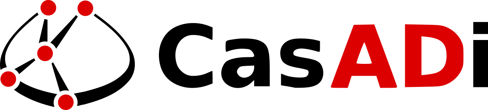
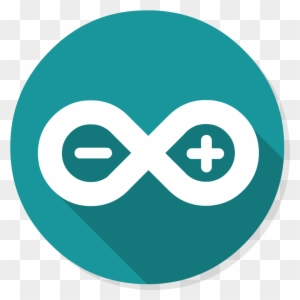
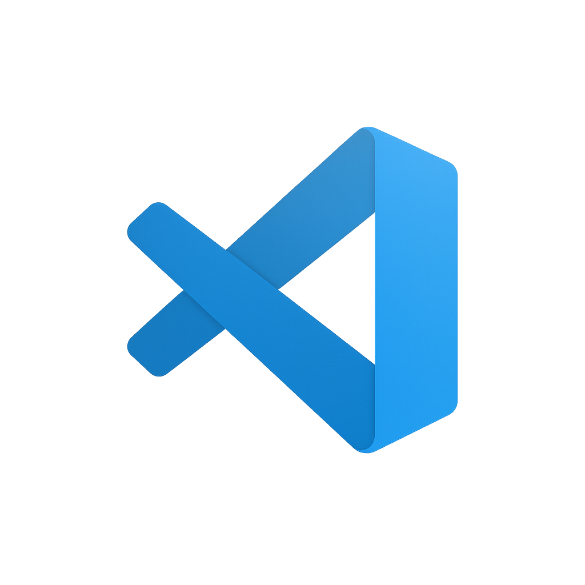
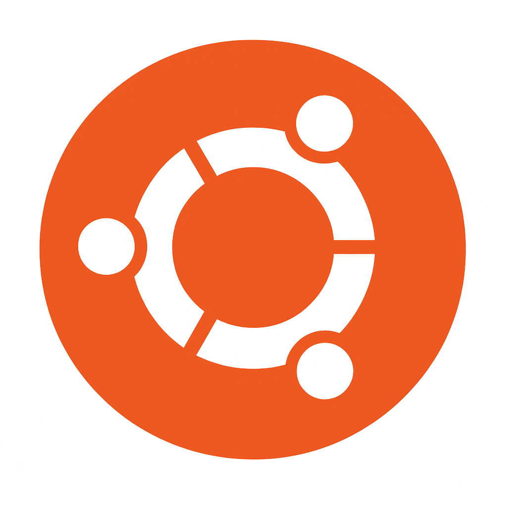

<h1 align="center">Hi 👋, I'm Lakshan</h1>
<h3 align="center">Robotics Enthusiast · Embedded Engineer 🤖</h3>

<em>B.E.Tech (Hons) in Instrumentation & Automation, University of Colombo</em>

---

🌱 I’m currently working on <strong>DESIGN OF A NEW CROP FIELD LAYOUT FOR VISION-BASED ROBOT NAVIGATION IN FUTURE AGRICULTURAL ROBOTICS</strong>.

---

---

<h3>🔗 Connect with me:</h3>

  
  

<h3>📦 Libraries I Use:</h3>

  
  
  
  
  

  
  
  
  

<h3>👨‍💻🧩 Embedded</h3>

  
  
  
  

<h3>🛠 Tools</h3>

  
  
  
  
  

---

### 📊 GitHub Stats:

---

 
  

