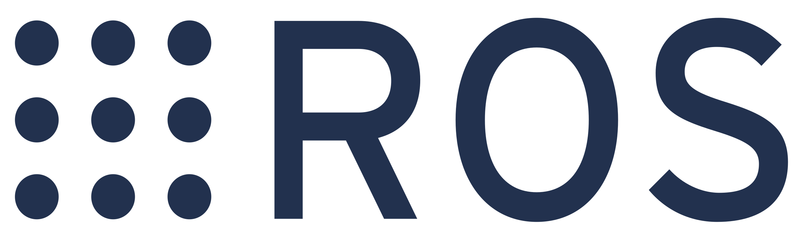

<h1 align="center">Hi 👋, I'm Lakshan Lavan</h1>
<h3 align="center">Robotics Enthusiast · Embedded Engineer 🤖</h3>

<em>B.E.Tech (Hons) in Instrumentation & Automation, University of Colombo</em>

- 🌱 I’m currently exploring <strong>ROS 2</strong>, AI-driven waypoint tracking, and real-time control for field robots.
- 📫 How to reach me: <a href="mailto:lakshanlavan29@gmail.com" title="Send to my Gmail">lakshan@ieee.org</a>

---

<h3 align="left">🔗 Connect with me:</h3>

  

---
<h3>🤖 Robotics</h3>

  
  
  
  
  

<h3>🔧 Embedded</h3>

  
  
  
  

<h3>🛠 Tools</h3>

  
  
  
  
  

---

<h3>📊 GitHub Stats:</h3>

  

  

---

  

